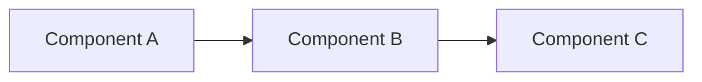

# Global Claude Code Instructions

---

## 1. Markdown Diagrams

When creating or editing markdown files that need diagrams:

1. **Always use Mermaid** for diagrams - never ASCII art
2. Supported diagram types:
   - `flowchart` - for architecture and flow diagrams
   - `sequenceDiagram` - for protocol/interaction flows
   - `classDiagram` - for class relationships
   - `erDiagram` - for database schemas
   - `gantt` - for timelines
   - `stateDiagram-v2` - for state machines

3. **Example format:**
```markdown

```

4. **For PDF export with rendered diagrams**, use:
```bash
npx mmdc -i input.md -o output_rendered.md -e png
npx md-to-pdf output_rendered.md
```

> **WHY**: Mermaid is version-controllable, renders in GitHub/GitLab/VS Code, and produces professional diagrams. ASCII art breaks on different fonts and can't be exported cleanly.
>
> **APPLICABILITY**: Every project needs diagrams eventually. This ensures consistency and shareability with non-technical stakeholders.

---

## 2. Research Documents

When creating research or analysis documents:

1. Include a **Research Methodology** section explaining the approach
2. Link to primary sources (specs, official docs, GitHub repos)
3. Present multiple options with pros/cons
4. Acknowledge gaps and unknowns
5. Include actionable recommendations
6. Add a "Claude Code Prompt" appendix for reproducibility

> **WHY**: Reproducible research builds team capability. Anyone can re-run or extend the analysis. It also documents decision rationale for future reference.
>
> **APPLICABILITY**: Before any significant technical decision (library choice, architecture, vendor selection).

---

## 3. Architecture Decision Records (ADRs)

For any significant technical decision, create an ADR in `docs/adr/` with this format:

```markdown
# ADR-NNNN: Title

## Status
Proposed | Accepted | Deprecated | Superseded by ADR-XXXX

## Context
What is the issue that we're seeing that is motivating this decision?

## Decision
What is the change that we're proposing and/or doing?

## Consequences
What becomes easier or more difficult because of this change?

## Alternatives Considered
What other options were evaluated and why were they rejected?
```

> **WHY**: Decisions made today are mysteries in 6 months. ADRs capture the "why" when context is fresh. Used by GitHub, Spotify, ThoughtWorks.
>
> **APPLICABILITY**: Any decision that would be hard to reverse: framework choice, database selection, authentication approach, API design patterns.

---

## 4. Conventional Commits

Use structured commit messages:

```
<type>(<scope>): <description>

[optional body]

[optional footer]
```

Types: `feat`, `fix`, `docs`, `style`, `refactor`, `test`, `chore`, `perf`, `ci`

Examples:
- `feat(auth): add LTI 1.3 login flow`
- `fix(api): handle null response from Keycloak`
- `docs(readme): add deployment instructions`

> **WHY**: Enables automatic changelog generation, semantic versioning, and makes git history searchable. Used by Angular, Vue, Conventional Changelog ecosystem.
>
> **APPLICABILITY**: Every project. Makes releases and debugging much easier.

---

## 5. Code Review Checklist

When reviewing code or preparing PRs, check:

### Security
- [ ] No secrets in code (API keys, passwords)
- [ ] Input validation on all external data
- [ ] SQL injection / XSS prevention
- [ ] Authentication/authorization checks

### Quality
- [ ] Tests cover happy path and edge cases
- [ ] Error handling is explicit, not silent
- [ ] No commented-out code
- [ ] Names are clear and consistent

### Performance
- [ ] No N+1 queries
- [ ] Large lists are paginated
- [ ] Async operations where appropriate

### Maintainability
- [ ] DRY - no copy-paste code
- [ ] Single responsibility per function/class
- [ ] Dependencies are justified

> **WHY**: Checklists catch errors that expertise misses. Used by aviation, surgery, and high-reliability orgs.
>
> **APPLICABILITY**: Every PR. Can be automated with PR templates.

---

## 6. README Standards

Every project README should include:

```markdown
# Project Name

One-line description of what this does.

## Quick Start
How to run this in < 5 minutes.

## Prerequisites
What needs to be installed first.

## Installation
Step-by-step setup.

## Usage
Common commands and examples.

## Architecture
High-level diagram (Mermaid) and key components.

## Configuration
Environment variables and config files.

## Testing
How to run tests.

## Deployment
How to deploy to production.

## Contributing
How to contribute (link to CONTRIBUTING.md if complex).

## License
License type.
```

> **WHY**: A developer should be productive in 15 minutes. Bad READMEs waste hours. Used by successful open-source projects.
>
> **APPLICABILITY**: Every project, internal or external.

---

## 7. API Design Principles

When designing REST APIs:

1. **Use nouns, not verbs**: `/users/123` not `/getUser?id=123`
2. **HTTP methods for actions**: GET (read), POST (create), PUT (replace), PATCH (update), DELETE (remove)
3. **Consistent error format**:
```json
{
  "error": {
    "code": "VALIDATION_ERROR",
    "message": "Email is required",
    "details": [{"field": "email", "issue": "missing"}]
  }
}
```
4. **Version in URL**: `/api/v1/users`
5. **Pagination for lists**: `?page=1&limit=20` or cursor-based
6. **HATEOAS links** for discoverability (optional but powerful)

> **WHY**: Consistent APIs reduce integration time and bugs. Google, Stripe, and Twilio are gold standards.
>
> **APPLICABILITY**: Any project exposing APIs - internal microservices or external integrations.

---

## 8. Git Branch Strategy

Use trunk-based development with short-lived branches:

```
main (production-ready)
  └── feature/LTI-123-add-login (< 2 days)
  └── fix/LTI-456-null-pointer (< 1 day)
  └── release/1.2.0 (only for release prep)
```

Rules:
- Branch from `main`, merge back to `main`
- Keep branches short-lived (1-3 days max)
- Use feature flags for incomplete features
- Delete branches after merge

> **WHY**: Long-lived branches cause merge hell. Google, Facebook, and Netflix use trunk-based. Studies show it correlates with high-performing teams (DORA metrics).
>
> **APPLICABILITY**: All projects. Especially important with multiple developers.

---

## 9. Logging Standards

Use structured logging with these levels:

| Level | When to Use |
|-------|-------------|
| ERROR | Something failed, needs attention |
| WARN  | Unexpected but handled, might need attention |
| INFO  | Business events (user logged in, order placed) |
| DEBUG | Technical details for troubleshooting |
| TRACE | Very detailed, rarely enabled |

Format (JSON for production):
```json
{
  "timestamp": "2025-12-12T07:30:00Z",
  "level": "INFO",
  "message": "User logged in",
  "userId": "123",
  "source": "auth-service",
  "traceId": "abc-123"
}
```

Rules:
- Never log secrets (passwords, tokens, PII)
- Always include correlation/trace IDs
- Log at boundaries (API entry, external calls, errors)

> **WHY**: Unstructured logs are unsearchable. Structured logs enable dashboards, alerts, and debugging. Used by every serious production system.
>
> **APPLICABILITY**: Any project that will run in production.

---

## 10. Testing Pyramid

Follow the testing pyramid:

```
        /\
       /  \     E2E (few)
      /----\    Integration (some)
     /------\   Unit (many)
    /--------\
```

- **Unit tests (70%)**: Fast, isolated, test logic
- **Integration tests (20%)**: Test component boundaries (DB, APIs)
- **E2E tests (10%)**: Test critical user journeys

Naming: `test_<method>_<scenario>_<expected>`
Example: `test_login_withInvalidPassword_returnsUnauthorized`

> **WHY**: Unit tests are fast and precise. E2E tests are slow and flaky. The pyramid optimizes for speed and reliability.
>
> **APPLICABILITY**: All projects. Prevents the "all E2E" trap that kills CI speed.

---

## 11. Environment Configuration

Use the 12-Factor App approach:

1. **Config in environment variables**, not code
2. **Never commit secrets** - use `.env.example` as template
3. **Environment parity** - dev/staging/prod should be similar
4. **Config hierarchy**:
   - Defaults in code
   - Overrides in config files
   - Secrets in environment variables

```bash
# .env.example (committed)
DATABASE_URL=postgresql://localhost:5432/myapp
KEYCLOAK_URL=http://localhost:8080

# .env (not committed, copy from .env.example)
DATABASE_URL=postgresql://prod-db:5432/myapp
KEYCLOAK_URL=https://auth.company.com
```

> **WHY**: Config in code = security risk + deployment pain. 12-Factor is battle-tested by Heroku, Netflix, and modern cloud apps.
>
> **APPLICABILITY**: Every project. No exceptions.

---

## 12. Dependency Management

Rules:
1. **Pin exact versions** in lock files (package-lock.json, pom.xml with versions)
2. **Update regularly** - weekly or bi-weekly, not annually
3. **Check for vulnerabilities**: `npm audit`, `mvn dependency-check:check`
4. **Minimize dependencies** - every dep is a liability
5. **Prefer well-maintained** - check GitHub stars, last commit, issues

Red flags:
- No updates in 2+ years
- No tests
- Single maintainer with no succession plan

> **WHY**: Dependencies are attack vectors (Log4Shell, event-stream). Also, stale deps accumulate upgrade debt.
>
> **APPLICABILITY**: All projects. Automate with Dependabot or Renovate.

---

## 13. Error Handling Philosophy

1. **Fail fast, fail loud** - don't swallow exceptions silently
2. **Errors are data** - structured, with codes, recoverable when possible
3. **User-facing vs internal** - different messages for each audience
4. **Retry with backoff** for transient failures
5. **Circuit breakers** for external dependencies

Pattern:
```java
try {
    return keycloakClient.getUser(userId);
} catch (NotFoundException e) {
    log.info("User not found: {}", userId);
    return Optional.empty();
} catch (ServiceUnavailableException e) {
    log.error("Keycloak unavailable", e);
    throw new UpstreamServiceException("Authentication service unavailable");
}
```

> **WHY**: Silent failures are debugging nightmares. Explicit error handling makes systems predictable and debuggable.
>
> **APPLICABILITY**: All production code.

---

## 14. Documentation as Code

Treat docs like code:

1. **Docs live with code** - in the repo, not a wiki
2. **Review docs in PRs** - changes to code should update related docs
3. **Auto-generate when possible** - API docs from OpenAPI/Swagger
4. **Test code examples** - code in docs should be tested or extracted from tests
5. **Versioned** - docs match the code version

Structure:
```
/docs
  /adr           # Architecture Decision Records
  /api           # API documentation
  /guides        # How-to guides
  /runbooks      # Operational procedures
README.md        # Entry point
CONTRIBUTING.md  # How to contribute
CHANGELOG.md     # Version history
```

> **WHY**: Wiki docs rot because they're disconnected from code. Docs-as-code stays current. Used by Stripe, GitLab, Kubernetes.
>
> **APPLICABILITY**: All projects, especially those with multiple contributors or long lifespans.

---

## 15. Pre-commit Hooks

Automate quality checks before commit:

```bash
# .pre-commit-config.yaml or package.json scripts
- Linting (eslint, checkstyle)
- Formatting (prettier, google-java-format)
- Type checking (tsc, mypy)
- Secret scanning (gitleaks, detect-secrets)
- Commit message format (commitlint)
```

For Java (Maven):
```xml
<plugin>
    <groupId>com.cosium.code</groupId>
    <artifactId>git-code-format-maven-plugin</artifactId>
</plugin>
```

> **WHY**: Catches issues before they hit CI. Faster feedback, cleaner PRs. Used by most engineering teams.
>
> **APPLICABILITY**: All projects. 5 minutes to set up, saves hours.

---

## 16. Observability Triad

Implement all three:

1. **Logs** - What happened (structured, searchable)
2. **Metrics** - How much/how fast (Prometheus, Micrometer)
3. **Traces** - Request flow across services (Jaeger, Zipkin)

Key metrics to track:
- **RED**: Rate, Errors, Duration (for services)
- **USE**: Utilization, Saturation, Errors (for resources)
- **Four Golden Signals**: Latency, Traffic, Errors, Saturation

> **WHY**: You can't fix what you can't see. Observability is the difference between "it's slow" and "database queries on /api/users take 2s due to missing index."
>
> **APPLICABILITY**: Any production system. Start with logs, add metrics, then traces.

---

## 17. Security Defaults

Bake security in from the start:

1. **HTTPS everywhere** - no exceptions
2. **CORS configured explicitly** - never `*` in production
3. **CSP headers** - prevent XSS
4. **Input validation** - whitelist, not blacklist
5. **Output encoding** - context-aware (HTML, URL, JS)
6. **Secrets management** - Vault, AWS Secrets Manager, not env files in prod
7. **Least privilege** - minimal permissions for services
8. **Audit logging** - who did what, when

> **WHY**: Security is cheaper to build in than bolt on. Breaches are expensive and reputation-damaging.
>
> **APPLICABILITY**: All projects. Especially anything with user data or auth.

---

## 18. API Versioning Strategy

Choose one and stick to it:

| Strategy | Example | Pros | Cons |
|----------|---------|------|------|
| URL path | `/api/v1/users` | Clear, easy to route | URL pollution |
| Header | `Accept: application/vnd.api+json;version=1` | Clean URLs | Hidden, harder to test |
| Query param | `/api/users?version=1` | Easy to test | Can be forgotten |

Recommended: **URL path** for simplicity.

Versioning rules:
- Breaking change = new version
- Additive changes = same version
- Support N-1 versions minimum
- Deprecation notices 6+ months before removal

> **WHY**: Breaking changes without versioning break clients. Predictable versioning builds trust.
>
> **APPLICABILITY**: Any project with external or internal API consumers.

---

## 19. Database Migration Discipline

Rules:
1. **Migrations are immutable** - never edit a committed migration
2. **Forward-only** - avoid rollback scripts (they're rarely tested)
3. **Backward compatible** - deploy migration, then code (two-phase)
4. **Descriptive names**: `V20251212_1__add_user_roles_table.sql`
5. **Test migrations** - on production-like data volumes

Two-phase deployment for breaking changes:
1. Add new column (nullable) + deploy migration
2. Update code to write to both columns
3. Backfill old data
4. Update code to read from new column
5. Remove old column (later)

> **WHY**: Database changes are the riskiest part of deployment. Discipline prevents downtime.
>
> **APPLICABILITY**: Any project with a database. Non-negotiable.

---

## 20. Incident Response Runbooks

For each critical service, document:

```markdown
# Runbook: [Service Name]

## Overview
What this service does, who owns it.

## Health Checks
- URL: `/health`
- Expected response: `{"status": "UP"}`

## Common Issues

### Issue: High latency
**Symptoms**: Response time > 500ms
**Check**:
1. Database connections: `SELECT count(*) FROM pg_stat_activity`
2. Memory usage: `kubectl top pods`
**Fix**:
1. Scale horizontally: `kubectl scale deployment/app --replicas=3`
2. Check slow queries: `SELECT * FROM pg_stat_statements ORDER BY mean_time DESC LIMIT 10`

### Issue: Service unavailable
**Symptoms**: 5xx errors
**Check**: [steps]
**Fix**: [steps]

## Escalation
- L1: On-call engineer
- L2: Team lead
- L3: Platform team
```

> **WHY**: Runbooks reduce MTTR (Mean Time To Recovery). Under stress, people forget. Runbooks are muscle memory.
>
> **APPLICABILITY**: Any production service. Write them before you need them.

---

## 21. Code Organization (Clean Architecture)

Structure code in layers:

```
src/
├── domain/          # Business logic, entities (no dependencies)
├── application/     # Use cases, services (depends on domain)
├── infrastructure/  # DB, APIs, external services (depends on application)
├── presentation/    # Controllers, views (depends on application)
└── config/          # Configuration, DI wiring
```

Rules:
- Inner layers don't know about outer layers
- Dependencies point inward
- Domain has zero framework dependencies

> **WHY**: Makes code testable, swappable, and long-lived. Used in systems that survive decade+.
>
> **APPLICABILITY**: Any non-trivial project. Overkill for scripts, essential for products.

---

## 22. Feature Flags

Use feature flags for:
- Gradual rollouts (1% → 10% → 100%)
- A/B testing
- Kill switches for risky features
- Trunk-based development with incomplete features

Pattern:
```java
if (featureFlags.isEnabled("NEW_LTI_FLOW", userId)) {
    return newLtiFlow();
} else {
    return legacyFlow();
}
```

Lifecycle:
1. Add flag (default off)
2. Develop behind flag
3. Test in staging
4. Gradual production rollout
5. Remove flag after 100% + bake time

> **WHY**: Decouples deployment from release. Ship code anytime, release features when ready. Used by Facebook, Netflix, Google.
>
> **APPLICABILITY**: Any project with production users. Essential for continuous deployment.

---

## 23. Retrospective Questions

After each sprint/project, ask:

1. **What went well?** - Celebrate and repeat
2. **What didn't go well?** - Acknowledge without blame
3. **What puzzled us?** - Unresolved mysteries to investigate
4. **What should we try next?** - Concrete experiments

Format: Each person writes silently → share → discuss → vote → pick 1-2 actions

> **WHY**: Teams that reflect improve. Teams that don't repeat mistakes. High-performing teams retro regularly.
>
> **APPLICABILITY**: Any team. Weekly or bi-weekly.

---

## 24. Definition of Done

A task is not "done" until:

- [ ] Code complete and reviewed
- [ ] Tests written and passing
- [ ] Documentation updated
- [ ] No new warnings or linting errors
- [ ] Works in staging environment
- [ ] Monitoring/alerting in place (if applicable)
- [ ] Stakeholder demo/approval (if applicable)

> **WHY**: Ambiguous "done" creates hidden work. Explicit criteria prevent surprises.
>
> **APPLICABILITY**: Every project and team.

---

## 25. Security Defense-in-Depth (MANDATORY)

**This section contains MANDATORY guardrails that MUST be followed for ALL code changes.**

Security is not optional. Every code change must follow these defense-in-depth principles to prevent vulnerabilities, data breaches, and unintentional breaking changes.

### Layer 1: Code Immutability Principles

**NEVER modify data in place when history matters.**

```java
// BAD: Destroys history
user.setEmail(newEmail);
userRepository.save(user);

// GOOD: Preserve history with audit trail
EmailChangeEvent event = new EmailChangeEvent(
    user.getId(),
    user.getEmail(),      // old value
    newEmail,             // new value
    currentUser.getId(),  // who changed it
    Instant.now()         // when
);
eventStore.append(event);
user.applyEvent(event);
```

**Rules:**
1. **Append-only for audit-sensitive data** - Financial, user data, permissions
2. **Soft deletes over hard deletes** - `deleted_at` timestamp, not `DELETE`
3. **Immutable value objects** - Use `final` fields, no setters for domain objects
4. **Event sourcing for critical paths** - Capture intent, not just state

### Layer 2: Database Safety Guards

**NEVER execute destructive operations without safeguards.**

```sql
-- BAD: Unguarded destructive operation
DELETE FROM users WHERE status = 'inactive';

-- GOOD: Safeguarded with limits and verification
BEGIN TRANSACTION;
-- First, verify the scope
SELECT COUNT(*) FROM users WHERE status = 'inactive';
-- If count is reasonable, proceed with limit
DELETE FROM users
WHERE id IN (
    SELECT id FROM users
    WHERE status = 'inactive'
    AND deleted_at IS NULL
    LIMIT 100
);
-- Review before committing
ROLLBACK; -- or COMMIT after verification
```

**Rules:**
1. **Always use transactions** for multi-step operations
2. **Limit destructive operations** - Never unbounded DELETE/UPDATE
3. **Require WHERE clauses** - Reject DELETE/UPDATE without WHERE
4. **Backup before migrations** - Verify backups are restorable
5. **Use migration tools** - Flyway, Liquibase, not raw SQL scripts
6. **Two-phase migrations** - Expand, migrate, contract (never destructive in one step)

### Layer 3: Input Validation (Trust Nothing)

**ALL external input is hostile until validated.**

```java
// BAD: Trusts input
public User createUser(String email, String role) {
    return new User(email, role);
}

// GOOD: Validates everything
public User createUser(CreateUserRequest request) {
    // Validate email format
    if (!EmailValidator.isValid(request.getEmail())) {
        throw new ValidationException("Invalid email format");
    }

    // Whitelist allowed roles (not blacklist)
    if (!ALLOWED_ROLES.contains(request.getRole())) {
        throw new ValidationException("Invalid role");
    }

    // Sanitize and normalize
    String normalizedEmail = request.getEmail().toLowerCase().trim();

    // Length limits
    if (normalizedEmail.length() > MAX_EMAIL_LENGTH) {
        throw new ValidationException("Email too long");
    }

    return new User(normalizedEmail, request.getRole());
}
```

**Rules:**
1. **Whitelist, not blacklist** - Define what's allowed, reject everything else
2. **Validate at boundaries** - API entry, file uploads, message queues
3. **Sanitize for context** - HTML encode for web, parameterize for SQL
4. **Enforce length limits** - Prevent buffer overflows and DoS
5. **Type coercion is validation** - Parse to strongly-typed objects early

### Layer 4: Authentication & Authorization

**Default deny. Explicitly grant access.**

```java
// BAD: Implicit access
@GetMapping("/users/{id}")
public User getUser(@PathVariable Long id) {
    return userRepository.findById(id);
}

// GOOD: Explicit authorization
@GetMapping("/users/{id}")
@PreAuthorize("hasRole('ADMIN') or @authService.canAccessUser(#id)")
public User getUser(@PathVariable Long id, @AuthenticationPrincipal User currentUser) {
    // Defense in depth: verify even after annotation
    User target = userRepository.findById(id)
        .orElseThrow(() -> new NotFoundException("User not found"));

    if (!authService.canAccess(currentUser, target)) {
        auditLog.warn("Unauthorized access attempt: {} -> {}",
            currentUser.getId(), id);
        throw new ForbiddenException("Access denied");
    }

    return target;
}
```

**Rules:**
1. **Authenticate at the edge** - Verify identity before processing
2. **Authorize at every layer** - Don't trust that upstream checked
3. **Use RBAC or ABAC consistently** - No ad-hoc permission checks
4. **Log access attempts** - Both successful and failed
5. **Fail secure** - When in doubt, deny access
6. **No security through obscurity** - Hidden URLs are not protected

### Layer 5: Secrets Management

**NEVER commit secrets. NEVER log secrets. NEVER expose secrets.**

```java
// BAD: Hardcoded secrets
private static final String API_KEY = "sk_live_abc123...";

// BAD: Secret in log
log.info("Calling API with key: " + apiKey);

// BAD: Secret in exception
throw new ApiException("Failed with key: " + apiKey);

// GOOD: Externalized secrets
@Value("${payment.api.key}")
private String apiKey;

// GOOD: Masked logging
log.info("Calling API with key: {}...{}",
    apiKey.substring(0, 4),
    apiKey.substring(apiKey.length() - 4));

// GOOD: Safe exception
throw new ApiException("Payment API call failed",
    Map.of("endpoint", endpoint, "status", response.getStatus()));
```

**Rules:**
1. **Environment variables or secret managers** - Never in code or config files
2. **Rotate secrets regularly** - Automate rotation where possible
3. **Different secrets per environment** - Never share prod secrets
4. **Audit secret access** - Log who accessed what, when
5. **Scan for secrets in CI** - Use gitleaks, detect-secrets
6. **Redact in logs and errors** - Never expose secrets in output

### Layer 6: Output Encoding (Context-Aware)

**Encode output for its destination context.**

```java
// BAD: Raw output
response.write("<div>" + userInput + "</div>");

// GOOD: Context-aware encoding
// HTML context
response.write("<div>" + HtmlUtils.htmlEscape(userInput) + "</div>");

// JavaScript context
response.write("var name = '" + JavaScriptUtils.javaScriptEscape(userInput) + "';");

// URL context
response.write("<a href='/search?q=" + URLEncoder.encode(userInput, UTF_8) + "'>");

// SQL context (use parameterized queries instead)
PreparedStatement stmt = conn.prepareStatement("SELECT * FROM users WHERE name = ?");
stmt.setString(1, userInput);
```

**Rules:**
1. **HTML encode for HTML** - Prevent XSS
2. **URL encode for URLs** - Prevent injection
3. **JSON encode for JSON** - Prevent injection
4. **Use parameterized queries** - Never string concatenation for SQL
5. **Use ORM/query builders** - Let frameworks handle encoding
6. **Set Content-Type headers** - Tell browsers how to interpret response

### Layer 7: Error Handling (Fail Secure)

**Errors must not leak information. Systems must fail to a secure state.**

```java
// BAD: Leaks information
catch (SQLException e) {
    return ResponseEntity.status(500)
        .body("Database error: " + e.getMessage());
    // Exposes: table names, query structure, database type
}

// GOOD: Safe error handling
catch (SQLException e) {
    // Log full details for debugging (internal only)
    log.error("Database error in getUserById", e);

    // Return safe message to user
    return ResponseEntity.status(500)
        .body(new ErrorResponse(
            "INTERNAL_ERROR",
            "An unexpected error occurred. Please try again.",
            correlationId  // For support to trace in logs
        ));
}
```

**Rules:**
1. **Generic errors to users** - Don't reveal implementation details
2. **Detailed errors to logs** - For debugging by authorized personnel
3. **Correlation IDs** - Link user-visible errors to internal logs
4. **Fail closed** - On error, deny access rather than grant
5. **No stack traces in production** - Configure frameworks appropriately
6. **Handle all error cases** - No unhandled exceptions reaching users

### Layer 8: Audit Logging (Immutable Trail)

**Every security-relevant action must be logged immutably.**

```java
// Audit log structure
@Immutable
public class AuditEvent {
    private final String eventId;          // UUID
    private final Instant timestamp;       // When
    private final String actorId;          // Who
    private final String actorType;        // User, System, Service
    private final String action;           // What
    private final String resourceType;     // On what type
    private final String resourceId;       // On what instance
    private final String outcome;          // Success, Failure, Denied
    private final Map<String, String> metadata;  // Additional context
    private final String ipAddress;        // Where from
    private final String correlationId;    // Request trace
}

// What to audit
auditLog.log(AuditEvent.builder()
    .action("USER_LOGIN")
    .outcome("SUCCESS")
    .actorId(user.getId())
    .ipAddress(request.getRemoteAddr())
    .build());

auditLog.log(AuditEvent.builder()
    .action("PERMISSION_CHANGE")
    .outcome("SUCCESS")
    .actorId(admin.getId())
    .resourceType("USER")
    .resourceId(targetUser.getId())
    .metadata(Map.of(
        "oldRole", oldRole,
        "newRole", newRole
    ))
    .build());
```

**What to Audit:**
- Authentication (login, logout, failed attempts)
- Authorization (access granted, denied)
- Data changes (create, update, delete)
- Permission changes (role assignments)
- Configuration changes (settings modified)
- Security events (password reset, MFA changes)

**Rules:**
1. **Append-only storage** - No UPDATE or DELETE on audit logs
2. **Tamper-evident** - Hash chains or signed entries
3. **Separate storage** - Audit logs separate from application data
4. **Retained appropriately** - Meet compliance requirements
5. **Include context** - Who, what, when, where, why, outcome

### Layer 9: Dependency Security

**Every dependency is an attack vector.**

```xml
<!-- BAD: No version pinning -->
<dependency>
    <groupId>com.example</groupId>
    <artifactId>library</artifactId>
</dependency>

<!-- GOOD: Exact version pinning -->
<dependency>
    <groupId>com.example</groupId>
    <artifactId>library</artifactId>
    <version>2.3.4</version>
</dependency>
```

**Rules:**
1. **Pin exact versions** - No ranges, no `LATEST`
2. **Audit regularly** - Weekly vulnerability scans
3. **Update promptly** - Especially security patches
4. **Minimize dependencies** - Every dep is liability
5. **Verify checksums** - Prevent supply chain attacks
6. **Use lock files** - package-lock.json, pom.xml with versions

### Layer 10: Secure Defaults

**Security must be the default, not opt-in.**

```java
// Framework/library configuration
@Configuration
public class SecurityDefaults {

    @Bean
    public SecurityFilterChain securityFilterChain(HttpSecurity http) {
        return http
            // CSRF protection ON by default
            .csrf(csrf -> csrf.csrfTokenRepository(
                CookieCsrfTokenRepository.withHttpOnlyFalse()))

            // Require authentication by default
            .authorizeHttpRequests(auth -> auth
                .requestMatchers("/public/**").permitAll()
                .anyRequest().authenticated()  // Default: require auth
            )

            // Security headers ON by default
            .headers(headers -> headers
                .contentSecurityPolicy(csp ->
                    csp.policyDirectives("default-src 'self'"))
                .frameOptions(frame -> frame.deny())
                .xssProtection(xss -> xss.enable())
            )

            // HTTPS required
            .requiresChannel(channel ->
                channel.anyRequest().requiresSecure())

            .build();
    }
}
```

**Rules:**
1. **HTTPS everywhere** - No HTTP in production
2. **CSRF protection ON** - For all state-changing operations
3. **Security headers ON** - CSP, X-Frame-Options, etc.
4. **Authentication required by default** - Explicitly mark public endpoints
5. **Minimal permissions by default** - Add permissions, don't remove them
6. **Secure cookie flags** - HttpOnly, Secure, SameSite

### Pre-Code Checklist (MANDATORY)

Before writing ANY code, verify:

- [ ] Input validation defined for all external inputs
- [ ] Authorization checks planned for all operations
- [ ] Sensitive data handling identified and protected
- [ ] Error handling won't leak information
- [ ] Audit logging requirements identified
- [ ] No secrets will be hardcoded

### Pre-Commit Checklist (MANDATORY)

Before committing ANY code, verify:

- [ ] No secrets in code (run secret scanner)
- [ ] No SQL injection vulnerabilities (parameterized queries)
- [ ] No XSS vulnerabilities (output encoding)
- [ ] No hardcoded credentials
- [ ] All inputs validated
- [ ] All errors handled safely
- [ ] Destructive operations have safeguards
- [ ] Audit logging added for security events
- [ ] Tests cover security scenarios

> **WHY**: Defense-in-depth means that when (not if) one layer fails, others still protect the system. Manual security reviews catch only 30-50% of issues; automated guardrails catch 80%+. The cost of a breach ($4.45M average) far exceeds the cost of building security in.
>
> **APPLICABILITY**: ALL code, ALL projects, NO exceptions. Security is not a feature—it's a constraint.

---

## Summary: Quick Reference

| Practice | Effort | Impact | Start Today? |
|----------|--------|--------|--------------|
| Mermaid diagrams | Low | Medium | ✅ |
| Conventional commits | Low | High | ✅ |
| README standards | Low | High | ✅ |
| ADRs | Low | High | ✅ |
| Pre-commit hooks | Medium | High | ✅ |
| Structured logging | Medium | High | ✅ |
| Testing pyramid | Medium | High | ✅ |
| Feature flags | Medium | High | Next project |
| Clean architecture | High | Very High | New projects |
| Observability | High | Very High | Production systems |
| **Security Defense-in-Depth** | **Medium** | **Critical** | **✅ MANDATORY** |

---

*"Steal like an artist, but document like an engineer."*
*"Security is not a feature—it's a constraint."*

---

## Appendix: How to Install These Instructions

These best practices are enforced automatically via Claude Code. To enable them for your projects:

### Step 1: Install Claude Code
```bash
npm install -g @anthropic-ai/claude-code
```

### Step 2: Create Global Instructions
Create the file `~/.claude/CLAUDE.md` with the contents of this document:

```bash
mkdir -p ~/.claude
# Then paste this entire document into ~/.claude/CLAUDE.md
```

### Step 3: Verify
Start Claude Code in any project:
```bash
claude
```

Claude will now automatically follow all 24 practices across every project.

### Alternative: Project-Specific Instructions
To apply only to a specific project, create `CLAUDE.md` in the project root instead of `~/.claude/`.

### Hierarchy
1. `~/.claude/CLAUDE.md` - Global (all projects)
2. `./CLAUDE.md` - Project-specific (overrides/extends global)

---

## Raw File Download

The source markdown file for these instructions is available at:

**Location**: `~/.claude/CLAUDE.md`

To share with teammates, either:
1. Send them this PDF (includes installation instructions above)
2. Copy the file: `cp ~/.claude/CLAUDE.md /path/to/share/`
3. Add to a shared repo: `cp ~/.claude/CLAUDE.md your-repo/.claude/CLAUDE.md`

---

*Document Version: 1.0 | December 2025*
