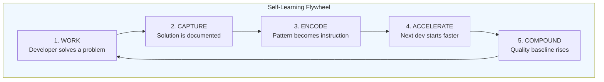
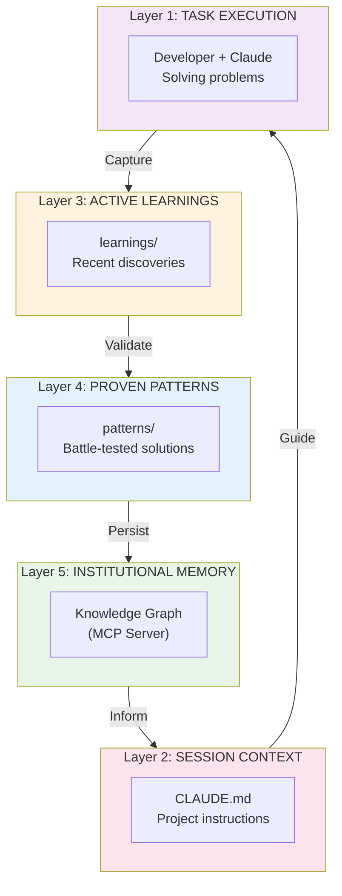
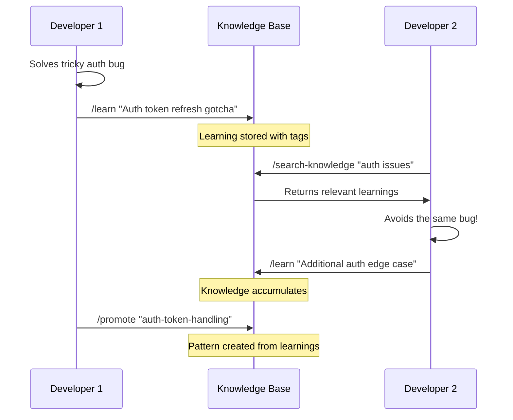

# Self-Learning Flywheel Framework

> *"The more work you do, the smarter the project becomes. Individual breakthroughs become collective intelligence. Quality compounds exponentially."*

---

## The Core Concept



### The Flywheel Effect

| Cycle | What Happens | Result |
|-------|--------------|--------|
| 1 | First dev discovers auth pattern | Pattern documented |
| 2 | Second dev uses pattern, finds edge case | Pattern improved |
| 3 | Third dev uses improved pattern instantly | Saves hours |
| 10 | Pattern is battle-tested, edge cases covered | Near-perfect |
| 100 | Pattern is institutional knowledge | Competitive advantage |

**Key Insight**: Unlike traditional documentation that rots, this system *improves* with use.

---

## Architecture: The 5 Knowledge Layers



---

## Implementation

### Directory Structure

```
your-project/
├── CLAUDE.md                    # Layer 2: Project instructions
├── .claude/
│   ├── memory.json              # Layer 5: Knowledge graph data
│   ├── learnings/               # Layer 3: Active learnings
│   │   ├── 2025-12-12.md        # Today's discoveries
│   │   └── ...
│   ├── patterns/                # Layer 4: Proven patterns
│   │   ├── auth-patterns.md
│   │   ├── error-handling.md
│   │   └── ...
│   ├── failures/                # Anti-patterns (equally valuable)
│   │   ├── what-not-to-do.md
│   │   └── ...
│   ├── decisions/               # ADRs
│   │   └── adr/
│   └── commands/                # Slash commands
│       ├── learn.md             # Capture a learning
│       ├── promote.md           # Promote learning to pattern
│       └── search-knowledge.md  # Search institutional memory
```

---

## The 4 Critical Slash Commands

### 1. `/learn` - Capture Discovery

```markdown
---
description: Capture a learning from current work
---

# Capture Learning

When you discover something valuable during development:

1. **Identify the learning type**:
   - BUG_FIX: How a tricky bug was solved
   - PATTERN: A reusable approach that worked
   - GOTCHA: A non-obvious trap to avoid
   - PERFORMANCE: An optimization that worked
   - INTEGRATION: How two systems connect

2. **Document with structure**:

```markdown
## [DATE] - [TITLE]

### Context
What were you trying to do?

### Discovery
What did you learn?

### Evidence
Code snippet, error message, or proof

### Applicability
When should this be applied?

### Tags
#auth #performance #database
```

3. **Save to `.claude/learnings/YYYY-MM-DD.md`**

4. **Update knowledge graph**:
```
mcp__memory__create_entities([{
  name: "Learning: [TITLE]",
  entityType: "learning",
  observations: ["[KEY INSIGHT]"]
}])
```

$ARGUMENTS

What did you learn? Describe the context and discovery.
```

### 2. `/promote` - Elevate Learning to Pattern

```markdown
---
description: Promote a validated learning to a proven pattern
---

# Promote to Pattern

When a learning has been validated through:
- [ ] Used successfully 3+ times
- [ ] Reviewed by another developer
- [ ] No negative side effects observed

**Promotion Process**:

1. **Extract from learnings**:
   - Find the original learning
   - Gather all related learnings on the topic
   - Synthesize into comprehensive pattern

2. **Create pattern file**:

```markdown
# Pattern: [NAME]

## Status: PROVEN

## Problem
What problem does this solve?

## Solution
The recommended approach with code examples.

## Why This Works
The reasoning behind the pattern.

## When to Use
- Scenario 1
- Scenario 2

## When NOT to Use
- Anti-scenario 1
- Anti-scenario 2

## Examples
Real code from this project.

## History
- First discovered: [DATE] by [WHO]
- Validated: [DATE] after [N] uses
- Last updated: [DATE]
```

3. **Update CLAUDE.md** to reference pattern:
```markdown
## Patterns to Follow
- See `.claude/patterns/[pattern-name].md` for [description]
```

4. **Update knowledge graph** with relations

$ARGUMENTS

Which learning should be promoted? Provide the learning title or date.
```

### 3. `/search-knowledge` - Query Institutional Memory

```markdown
---
description: Search project's accumulated knowledge
---

# Search Knowledge

Query the project's institutional memory to find relevant:
- Learnings
- Patterns
- Decisions (ADRs)
- Past failures to avoid

**Search Process**:

1. **Query knowledge graph**:
```
mcp__memory__search_nodes("[QUERY]")
```

2. **Search learnings files**:
```bash
grep -r "[QUERY]" .claude/learnings/
grep -r "[QUERY]" .claude/patterns/
```

3. **Synthesize findings** into actionable guidance

4. **If gap found**: Flag for future learning capture

$ARGUMENTS

What are you looking for? Describe your problem or question.
```

### 4. `/retro-capture` - Post-Task Knowledge Harvest

```markdown
---
description: Harvest learnings after completing significant work
---

# Retrospective Capture

After completing any significant task, harvest knowledge:

## Questions to Answer

1. **What worked well?**
   - Any patterns to promote?
   - Any shortcuts discovered?

2. **What was harder than expected?**
   - Any gotchas to document?
   - Any failures to record?

3. **What would you do differently?**
   - Process improvements?
   - Tool suggestions?

4. **What questions remain?**
   - Unresolved mysteries?
   - Areas needing research?

## Output

For each valuable answer:
1. Create learning entry
2. Update knowledge graph
3. If pattern emerges, flag for `/promote`

$ARGUMENTS

What task did you just complete? Summarize the work done.
```

---

## CLAUDE.md Integration

Add this section to your project's CLAUDE.md:

```markdown
## Self-Learning Protocol (MANDATORY)

### Before Starting Work
1. **Search knowledge**: `mcp__memory__search_nodes("[relevant topic]")`
2. **Check patterns**: Review `.claude/patterns/` for relevant patterns
3. **Check failures**: Review `.claude/failures/` to avoid known pitfalls

### During Work
1. **Note discoveries**: When you learn something non-obvious, note it
2. **Flag patterns**: If you see repetition, flag for pattern extraction
3. **Document gotchas**: Record any surprises or unexpected behaviors

### After Completing Work
1. **Run `/retro-capture`**: Harvest learnings from the completed task
2. **Update knowledge graph**: Add new entities and relations
3. **Propose promotions**: If any learning is ready to become a pattern

### Knowledge Graph Commands
- `mcp__memory__create_entities` - Add new knowledge
- `mcp__memory__search_nodes` - Find relevant knowledge
- `mcp__memory__create_relations` - Link related concepts
- `mcp__memory__read_graph` - See full knowledge structure
```

---

## The Exponential Quality Effect

```mermaid
flowchart LR
    subgraph WEEK1["Week 1"]
        W1A["10 learnings"]
        W1B["0 patterns"]
        W1C["Quality: Baseline"]
    end

    subgraph WEEK4["Week 4"]
        W4A["50 learnings"]
        W4B["5 patterns"]
        W4C["Quality: +30%"]
    end

    subgraph WEEK12["Week 12"]
        W12A["150 learnings"]
        W12B["20 patterns"]
        W12C["Quality: +100%"]
    end

    subgraph WEEK52["Week 52"]
        W52A["500+ learnings"]
        W52B["50+ patterns"]
        W52C["Quality: +300%"]
    end

    WEEK1 --> WEEK4 --> WEEK12 --> WEEK52
```



### Why Quality Compounds

| Mechanism | Effect |
|-----------|--------|
| **Failure Prevention** | Every documented failure prevents future occurrences |
| **Pattern Reuse** | Proven patterns replace ad-hoc solutions |
| **Onboarding Acceleration** | New devs inherit accumulated wisdom |
| **Consistency** | Same patterns used everywhere |
| **Review Efficiency** | Reviewers check against known patterns |

---

## Team Synchronization

### Individual → Team Knowledge Flow



### Weekly Knowledge Sync Ritual

```markdown
## Weekly Knowledge Review (15 min)

1. **Review new learnings** (5 min)
   - What was discovered this week?
   - Any patterns emerging?

2. **Promote patterns** (5 min)
   - Which learnings are ready for promotion?
   - Vote on pattern quality

3. **Update CLAUDE.md** (5 min)
   - Add references to new patterns
   - Remove outdated guidance
```

---

## Setup Guide

### Step 1: Install MCP Memory Server

```bash
# Add to Claude Code
claude mcp add-json "memory" '{"command":"npx","args":["-y","@modelcontextprotocol/server-memory"]}'
```

### Step 2: Create Directory Structure

```bash
mkdir -p .claude/{learnings,patterns,failures,decisions/adr,commands}
touch .claude/learnings/.gitkeep
touch .claude/patterns/.gitkeep
touch .claude/failures/.gitkeep
```

### Step 3: Create Slash Commands

Copy the 4 slash commands above into:
- `.claude/commands/learn.md`
- `.claude/commands/promote.md`
- `.claude/commands/search-knowledge.md`
- `.claude/commands/retro-capture.md`

### Step 4: Update CLAUDE.md

Add the "Self-Learning Protocol" section to your project's CLAUDE.md.

### Step 5: Initialize Knowledge Graph

```
mcp__memory__create_entities([{
  name: "Project: [YOUR PROJECT]",
  entityType: "project",
  observations: ["Initialized self-learning flywheel on [DATE]"]
}])
```

---

## Measuring Success

### Leading Indicators
- Number of learnings captured per week
- Time from learning to pattern promotion
- Knowledge graph query frequency

### Lagging Indicators
- Bug recurrence rate (should decrease)
- Onboarding time for new developers
- Code review cycle time
- "We already solved this" moments (should decrease)

### Health Check Questions

| Question | Healthy Answer |
|----------|---------------|
| How many learnings this week? | 5+ per active developer |
| Any patterns promoted this month? | At least 1-2 |
| Is knowledge graph growing? | Yes, steadily |
| Are new devs finding answers? | Yes, before asking |

---

## Anti-Patterns to Avoid

### 1. Knowledge Hoarding
**Problem**: Devs don't capture learnings
**Solution**: Make `/retro-capture` mandatory after PRs

### 2. Stale Patterns
**Problem**: Patterns become outdated
**Solution**: Add "last validated" dates, review quarterly

### 3. Pattern Proliferation
**Problem**: Too many patterns, can't find relevant ones
**Solution**: Consolidate related patterns, use tags

### 4. Capture Friction
**Problem**: Too hard to document learnings
**Solution**: Make `/learn` as simple as possible

### 5. No Validation
**Problem**: Bad patterns get promoted
**Solution**: Require 3+ successful uses before promotion

---

## The Ultimate Goal

After 6-12 months of consistent use:

1. **New developers** are productive in days, not weeks
2. **Common bugs** are caught before they happen
3. **Code reviews** reference established patterns
4. **Architecture decisions** have documented rationale
5. **Quality** is measurably higher than when you started
6. **Velocity** increases despite growing complexity

---

## Sources & Inspiration

- [Claude Code Memory Management](https://code.claude.com/docs/en/memory)
- [Knowledge Graph Memory MCP](https://github.com/shaneholloman/mcp-knowledge-graph)
- [Data Flywheels for LLM Applications](https://www.sh-reya.com/blog/ai-engineering-flywheel/)
- [NVIDIA's Adaptive Data Flywheel](https://arxiv.org/html/2510.27051)
- [CyberArk: Baking the Flywheel into Development](https://medium.com/cyberark-engineering/baking-the-flywheel-into-your-development-process-c0e4e85d314a)
- [The Value Flywheel Effect](https://itrevolution.com/wp-content/uploads/2022/08/TVFE_Excerpt.pdf)

---

*"The best time to start capturing knowledge was day one. The second best time is now."*
